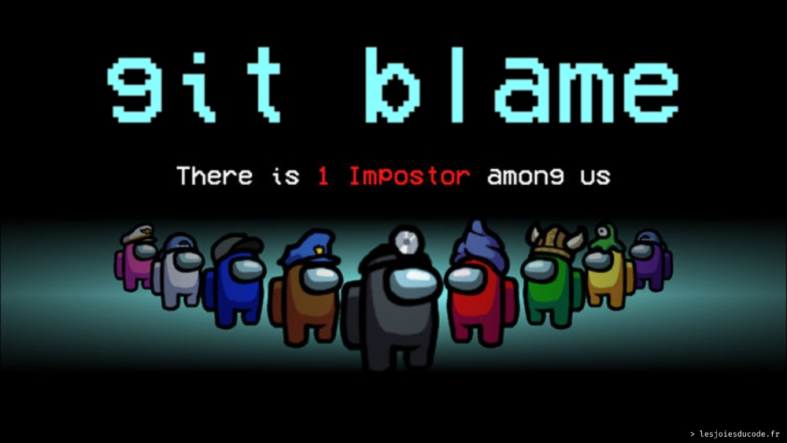

# Git

Git est un outil très utiliser, les lignes de commandes taper avec git seront journalières.......
Au début, c'est une prise de tête assuré et après cela devra un automatisme ;)

GIT est un système de contrôle de version distribué populaire utilisé pour suivre les modifications apportées à un ensemble de fichiers ou à un projet de développement logiciel. Il permet à plusieurs développeurs de travailler simultanément sur le même projet, en fournissant des outils pour la gestion des conflits, la fusion des modifications et la collaboration.

Avec GIT, chaque développeur dispose d'une copie complète de l'historique des modifications du projet sur son propre ordinateur. Les développeurs peuvent apporter des modifications à leur propre copie locale du projet, puis les publier ou les fusionner avec la version principale du projet, qui est hébergée sur un serveur central.

GIT offre également des fonctionnalités telles que les branches et les tags, qui permettent aux développeurs de travailler sur des versions différentes du projet en même temps, d'expérimenter de nouvelles fonctionnalités ou de corriger des bogues sans affecter la version principale du projet.

En utilisant GIT, les développeurs peuvent collaborer efficacement sur des projets de développement logiciel, suivre l'historique des modifications et gérer les différentes versions du code source. GIT est largement utilisé dans l'industrie du développement logiciel et est considéré comme un outil essentiel pour les projets de toutes tailles.

## Github et Gitlab

GitHub et GitLab sont deux plateformes populaires pour l'hébergement et la gestion de projets Git. Bien qu'ils partagent de nombreuses fonctionnalités communes, ils présentent également des différences clés dans leur approche et leur fonctionnement.

GitHub est une plateforme de développement collaboratif de logiciels basée sur Git, qui permet aux développeurs de travailler ensemble sur des projets et de partager du code. Il propose une interface utilisateur intuitive et une grande communauté d'utilisateurs, ce qui en fait une plateforme populaire pour les projets open source et commerciaux. GitHub offre également des fonctionnalités supplémentaires telles que le suivi des problèmes, la gestion de projet, l'hébergement de pages Web et l'intégration continue.

GitLab, quant à lui, est une plateforme de développement logiciel similaire à GitHub, mais avec une approche plus intégrée. En plus de l'hébergement Git, GitLab propose également des fonctionnalités de gestion de projet, de collaboration en équipe, de surveillance continue, d'intégration continue et de déploiement continu. Il est disponible en version hébergée sur le cloud et en version auto-hébergée, ce qui permet aux utilisateurs de l'adapter à leurs propres besoins.

Bien que les deux plateformes offrent des fonctionnalités similaires, GitLab a tendance à offrir des fonctionnalités plus avancées pour les équipes de développement, tandis que GitHub se concentre davantage sur les projets open source et la collaboration communautaire.

:::tip

En résumé, GitHub et GitLab sont deux plateformes de gestion de projets Git populaires qui offrent des fonctionnalités similaires, mais qui diffèrent dans leur approche et leur public cible. Les développeurs peuvent choisir la plateforme qui convient le mieux à leurs besoins et à ceux de leur équipe.

- Github : https://github.com/
- Gitlab : https://about.gitlab.com/fr-fr/

:::

# Concevoir un portefolio pour un débutant

Voici une explication plus détaillée pour créer un portfolio pour un développeur débutant:

1. Choisissez une plateforme pour héberger votre portfolio: Il existe plusieurs plateformes gratuites pour héberger votre portfolio en ligne, telles que GitHub Pages, Netlify, ou même créer votre propre site web avec un service de domaine et d'hébergement. Si vous ne vous sentez pas à l'aise avec la création d'un site web, vous pouvez également utiliser des plateformes de création de portfolios en ligne comme Behance ou Dribbble.

2. Concevez un design simple et attrayant: La conception de votre portfolio est très importante car c'est la première impression que vous donnez aux visiteurs. Vous devez donc créer un design simple, propre et professionnel qui met en valeur vos projets et vos compétences. Utilisez une palette de couleurs cohérente et des polices lisibles pour assurer une présentation élégante de votre travail.

3. Choisissez les projets à inclure: Vous devez choisir les projets qui démontrent vos compétences et vos connaissances. Si vous êtes débutant, incluez les projets sur lesquels vous avez travaillé tout au long de vos études ou de vos projets personnels. Choisissez des projets qui utilisent différentes technologies et qui résolvent des problèmes réels. Vous pouvez également inclure des projets open source pour montrer votre engagement envers la communauté de développement.

4. Décrivez vos projets: Pour chaque projet que vous incluez dans votre portfolio, il est important de fournir une description détaillée. Expliquez clairement les défis que vous avez relevés, les technologies que vous avez utilisées, les solutions que vous avez trouvées, et votre rôle dans le projet. Si vous avez travaillé en équipe, mentionnez les autres membres de l'équipe et leur rôle.

5. Ajoutez votre CV et vos informations de contact: N'oubliez pas d'inclure votre CV et vos informations de contact sur votre portfolio. Ajoutez votre adresse email, votre profil LinkedIn et d'autres informations qui peuvent aider les employeurs potentiels à vous contacter facilement.

Testez et optimisez votre portefeuille: Une fois votre portfolio créé, testez-le pour vous assurer qu'il est facile à naviguer et que les visiteurs peuvent facilement trouver les informations qu'ils recherchent. Demandez également à des amis ou à des gens du milieu de tester votre portfolio et de vous donner leur avis.

# Lien utiles

Petit jeu pour apprendre git

- https://learngitbranching.js.org/?locale=fr_FR
- http://marklodato.github.io/visual-git-guide/index-fr.html

# Mémo

Mémo pour aider à se souvenir :

- https://git.goffinet.org/03-les-branches-avec-git.html#cr%C3%A9er-une-nouvelle-branche
- https://training.github.com/downloads/fr/github-git-cheat-sheet.pdf
