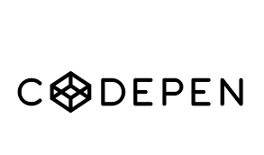

# HTML / JavaScript

Voici un pêle-mêle de site qui seront très utiles pour la partie développement web

# HTML

HTML (Hypertext Markup Language) est le langage de balisage standard utilisé pour créer des pages Web. Il s'agit d'un langage informatique qui permet aux développeurs de structurer et de présenter le contenu d'un site Web. Les balises HTML sont utilisées pour définir les éléments de la page tels que les titres, les paragraphes, les images, les liens et les formulaires.

En utilisant des balises HTML, les développeurs peuvent créer des pages Web bien structurées, accessibles et interprétables par les navigateurs Web. Les navigateurs Web utilisent ces balises pour afficher le contenu de la page, la présentation et les fonctionnalités.

HTML est un langage relativement simple à apprendre et à utiliser, mais il peut également être très puissant lorsque combiné avec d'autres technologies Web telles que CSS (Cascading Style Sheets) pour la mise en forme et la présentation, et JavaScript pour l'interaction et la dynamique. Ensemble, ces technologies permettent aux développeurs de créer des sites Web modernes et réactifs qui offrent une expérience utilisateur exceptionnelle.

Flexbox et Grid sont des fonctionnalités de mise en page CSS qui permettent aux développeurs de créer des mises en page réactives et flexibles pour les sites Web.

## Flexbox et Grid

Flexbox est utilisé pour la création de mises en page unidimensionnelles, telles que les barres latérales, les en-têtes et les pieds de page, ainsi que pour le placement et l'alignement des éléments à l'intérieur de ces éléments.

Grid est utilisé pour créer des mises en page bidimensionnelles, telles que les mises en page en grille, les tableaux et les galeries d'images. Il permet aux développeurs de définir des zones dans la page et de placer les éléments à l'intérieur de ces zones de manière flexible.

En utilisant Flexbox et Grid, les développeurs peuvent créer des mises en page Web réactives qui s'adaptent facilement aux différents appareils et tailles d'écran. Cela permet de créer des sites Web modernes et professionnels qui offrent une expérience utilisateur exceptionnelle.

Jeux pour s'entraîner à maîtriser ces techniques :

- Flex -> https://flexboxfroggy.com/#fr
- Grid -> https://flukeout.github.io/ - https://cssgridgarden.com/
- https://www.codingame.com/start
- https://www.frontendmentor.io/?ref=code-garage.fr
- https://mastery.games/

## CSS

Le CSS, ou Cascading Style Sheets (feuilles de style en cascade), est un langage utilisé pour décrire la présentation et le style d'un document HTML (HyperText Markup Language). Il permet de contrôler l'apparence des éléments d'une page web, tels que les couleurs, les polices, les marges, les espacements, les arrière-plans, etc.

Le CSS fonctionne en associant des règles de style à des éléments HTML. Ces règles sont écrites dans des blocs de déclaration, qui contiennent des propriétés et leurs valeurs. Par exemple, pour définir la couleur de texte d'un paragraphe, vous pouvez utiliser la propriété "color" avec une valeur spécifique.

## CodePen

CodePen est une plateforme en ligne pour les développeurs Web qui permet de créer, partager et tester des snippets de code HTML, CSS et JavaScript. Il s'agit essentiellement d'un éditeur de code en ligne qui permet aux utilisateurs de créer des projets de développement Web à partir de zéro ou de travailler sur des projets existants.

CodePen fournit une interface utilisateur simplifiée qui permet aux développeurs de créer et de tester rapidement du code en temps réel. Les utilisateurs peuvent également partager leur code avec d'autres développeurs en utilisant une URL unique pour leur projet, ce qui facilite la collaboration et le partage de connaissances.

En outre, CodePen offre une vaste bibliothèque de ressources, telles que des modèles de code, des snippets et des démos, qui peuvent être utilisées pour accélérer le processus de développement et pour apprendre de nouvelles techniques et astuces.

CodePen est une plateforme populaire pour les développeurs Web débutants et expérimentés qui souhaitent créer, expérimenter et partager des projets de développement Web.

- https://codepen.io/

# Java-Script

JavaScript est un langage de programmation de haut niveau, interprété et dynamique, qui est utilisé pour développer des applications Web interactives et dynamiques. Il est souvent appelé "langage de script côté client" car il est exécuté dans le navigateur Web du client, plutôt que sur le serveur. JavaScript est utilisé pour créer des fonctionnalités interactives telles que les menus déroulants, les carrousels, les pop-ups et les formulaires interactifs.

En plus d'être utilisé pour le développement Web, JavaScript peut également être utilisé pour créer des applications mobiles, des jeux, des applications de bureau et des logiciels serveur.

- https://stateofjs.com/en-us/
- https://www.pierre-giraud.com/javascript-apprendre-coder-cours/

## Framework JS

Un framework JavaScript est un ensemble d'outils et de bibliothèques de code qui facilite la création d'applications Web en fournissant des fonctionnalités et des structures de base prêtes à l'emploi. Il est souvent considéré comme une infrastructure logicielle sur laquelle les développeurs peuvent construire leur propre code pour répondre à des besoins spécifiques.

Les frameworks JavaScript les plus populaires comprennent React, Angular, Vue.js, Ember.js, Backbone.js, Meteor, etc. Ces frameworks fournissent une structure de base pour le développement Web en fournissant des composants, des modèles, des directives, des contrôleurs, des services et des outils de développement.

Les avantages de l'utilisation d'un framework JavaScript incluent la rapidité de développement, la réutilisabilité du code, l'abstraction de la complexité du code et la cohérence du code au sein d'une équipe de développement. Les frameworks JavaScript permettent également aux développeurs de se concentrer sur les aspects les plus importants de leur application plutôt que de perdre du temps à créer des fonctionnalités de base à partir de zéro.

Cependant, chaque framework a ses propres avantages et inconvénients et les développeurs doivent choisir celui qui convient le mieux à leur projet. En général, les frameworks JavaScript sont des outils précieux pour les développeurs Web professionnels qui cherchent à créer des applications Web de haute qualité plus rapidement et plus efficacement.

- https://fr.legacy.reactjs.org/docs/getting-started.html
- https://angular.io/docs
- https://vuejs.org/guide/introduction.html

Petit article exemple sur un framework tendance :

- https://dev.to/zenika/solidstart-integration-with-mongodb-29l4

# Client lourd

Un client lourd (ou "thick client" en anglais) est une application informatique qui s'exécute sur un ordinateur local et qui nécessite une installation et une configuration sur l'ordinateur de l'utilisateur. Contrairement à un client léger (ou "thin client"), qui s'exécute dans un navigateur Web et qui ne nécessite pas d'installation ou de configuration sur l'ordinateur de l'utilisateur.

Le client lourd est généralement considéré comme une solution plus puissante et plus complète que le client léger car il peut fournir une meilleure expérience utilisateur, une interface plus riche et des fonctionnalités avancées qui peuvent être difficiles à implémenter avec un client léger. Cependant, le client lourd nécessite souvent plus de ressources système et peut être plus difficile à installer et à maintenir que le client léger.

Les exemples courants de clients lourds incluent les logiciels de traitement de texte, les logiciels de conception graphique, les jeux vidéo, les applications de bureau et les logiciels de productivité professionnelle.
Exemple de client lourd :

- Microsoft Office : c'est une suite de logiciels de productivité professionnelle qui inclut des applications telles que Word, Excel, PowerPoint, Outlook, etc. qui s'exécutent localement sur l'ordinateur de l'utilisateur.

- Adobe Creative Suite : c'est une suite de logiciels de conception graphique professionnelle qui inclut des applications telles que Photoshop, Illustrator, InDesign, etc. qui s'exécutent localement sur l'ordinateur de l'utilisateur.

- Jeux vidéo : les jeux vidéo modernes, en particulier ceux avec des graphismes avancés et une jouabilité complexe, sont souvent considérés comme des clients lourds car ils nécessitent une installation et s'exécutent localement sur l'ordinateur de l'utilisateur.

# Mémo

Mémo pour aider à se souvenir :

- https://isnbreizh.fr/snt/activity/htmlcss/memoHtmlCss.pdf
- https://jenseign.com/html/wp-content/uploads/2018/01/memo-html-apprendre.pdf

Ce guide couvre les concepts de base du développement Web, tels que HTML, CSS, Bootstrap, AJAX et JavaScript.

**Bootstrap** est un framework CSS populaire qui permet de créer des sites Web responsives et mobiles rapidement et facilement. Il fournit des composants et des styles pré-conçus qui peuvent être utilisés pour créer des mises en page modernes et élégantes.

**AJAX** est une technique qui permet de mettre à jour une partie d'une page Web sans avoir besoin de recharger la page entière. Cela améliore l'expérience utilisateur en rendant les pages plus rapides et plus interactives.

- http://tvaira.free.fr/web/HTML-CSS-JS.pdf
